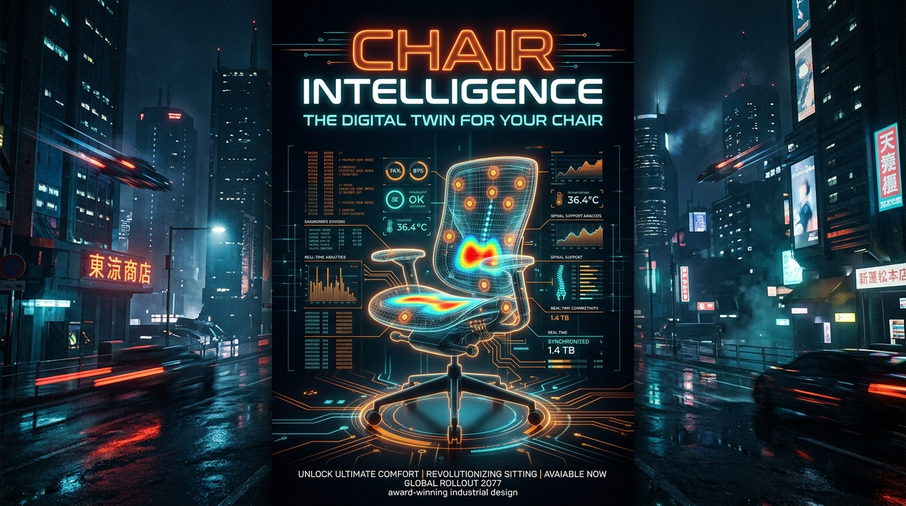

<div align="center">

# 🪑 CHAIR INTELLIGENCE™
### *The World's Most Advanced Digital Twin of an Overworked Office Chair*

[](https://vitejs.dev/)
[](https://react.dev/)
[](https://www.typescriptlang.org/)
[](https://tailwindcss.com/)
[](LICENSE)

<br/>



<br/>

> **"Your chair knows how long you've been sitting."**  
> A real-time telemetry dashboard and 3D digital twin for the most overworked piece of furniture in your room.  
> *Powered by unnecessarily sophisticated analytics and 6-axis cushion strain ingestion.*

---

</div>

## 🚀 Overview

**Chair Intelligence™** is an enterprise-grade, fictional ergonomic IoT telemetry platform designed for developers, gamers, and hackathon veterans who spend dangerous amounts of time sitting down. 

Equipped with a simulated sensor matrix, real-time stress heatmap visualizer, posture decay estimators, and an AI diagnostic engine, Chair Intelligence gives your furniture a voice (mostly to complain about crumb sediment and lumbar compression).

---

## ✨ Key Features

- 🛰️ **Interactive 3D Digital Twin Viewer**
  - Real-time 3D orbit, pitch, and yaw tracking.
  - Multi-node sensor matrix inspection (headrest, upper mesh, lumbar, seat base, gas lift, 5-star base).
  - Dynamic stress heatmap and wireframe diagnostics mode.
  - Crumb sediment and cushion fatigue telemetry.

- 📊 **Real-Time Telemetry & Behavioral Analytics**
  - **Gluteus-to-Cushion Duration**: Precision unbroken sitting tracking.
  - **Vertical Elevation Events**: Real-time tally of stand-up attempts.
  - **"I'll start now" Frequency**: Statistical model comparing verbal commitments vs. actual execution.
  - **Sanity Index & Complaint Stream**: Live monitor of furniture distress levels.

- ⚡ **Hackathon Mode**
  - High-cadence real-time telemetry stream, simulated network activity, sound effects, and ambient SFX.

- 🧠 **Extreme AI Diagnostics & Verdicts**
  - Generates detailed ergonomic predictions, chair health scores, and personalized behavioral verdicts.

---

## 🛠️ Tech Stack

- **Framework**: [React 19](https://react.dev/) + [Vite](https://vitejs.dev/)
- **Language**: [TypeScript](https://www.typescriptlang.org/)
- **Styling**: [Tailwind CSS v4](https://tailwindcss.com/) + Custom Glassmorphism UI
- **Icons & Motion**: [Lucide React](https://lucide.dev/), [Motion](https://motion.dev/)
- **Visuals**: WebGL Canvas, Canvas Confetti, SVG telemetry rendering
- **Audio Engine**: Web Audio API Synthesizer

---

## 📦 Getting Started

### Prerequisites

- [Node.js](https://nodejs.org/) (v18 or higher recommended)
- [npm](https://www.npmjs.com/) or [bun](https://bun.sh/)

### Installation

1. **Clone the repository:**
   ```bash
   git clone https://github.com/Aryanlokesh/Chair_Intelligence.git
   cd Chair_Intelligence
   ```

2. **Install dependencies:**
   ```bash
   npm install
   ```

3. **Configure Environment (Optional):**
   ```bash
   cp .env.example .env.local
   ```
   *Add your `GEMINI_API_KEY` if you wish to enable extended Google GenAI capabilities.*

4. **Start the local development server:**
   ```bash
   npm run dev
   ```

5. Open your browser and navigate to:
   ```
   http://localhost:3000/
   ```

---

## 📐 Project Structure

```
chair-intelligence/
├── public/
│   └── poster.jpg              # High-res Chair Intelligence promotional poster
├── src/
│   ├── components/
│   │   ├── ChairHealthMonitor.tsx     # Chair health status & diagnostics
│   │   ├── ChairPredictions.tsx       # AI ergonomic predictions
│   │   ├── DashboardMetrics.tsx       # Core telemetry stats & counters
│   │   ├── DeepInsightSection.tsx     # Extended analytics & charts
│   │   ├── DigitalTwinViewer.tsx      # 3D interactive chair twin & sensors
│   │   ├── ExtremeAnalysisModal.tsx   # Detailed analysis modal
│   │   ├── FinalVerdictSection.tsx    # Diagnostic verdict & export
│   │   ├── HackathonStatsBar.tsx      # Live hackathon mode ticker
│   │   ├── Header.tsx                 # Navigation & telemetry controls
│   │   ├── LandingHero.tsx            # Hero landing section
│   │   ├── ProcessingSequence.tsx     # Sequence state loader
│   │   ├── RealTimeActivityFeed.tsx   # Live stream of telemetry events
│   │   └── TelemetryForm.tsx          # User behavioral questionnaire
│   ├── utils/
│   │   ├── analyticsEngine.ts         # Telemetry calculation formulas
│   │   └── audio.ts                   # Web Audio synthesizer effects
│   ├── App.tsx                        # Main application layout & state
│   ├── index.css                      # Global styles & theme tokens
│   ├── main.tsx                       # React application entrypoint
│   └── types.ts                       # TypeScript interfaces
├── package.json
├── tsconfig.json
└── vite.config.ts
```

---

## 📜 License

Distributed under the MIT License. See `LICENSE` for more information.

<div align="center">
  <sub>Built with ☕, questionable posture, and unnecessarily advanced chair analytics.</sub>
</div>
